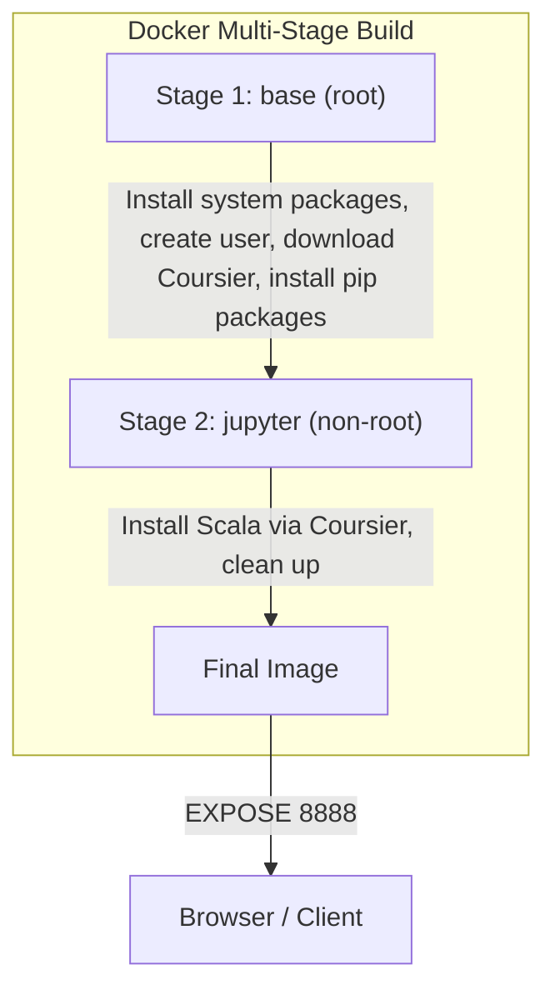

# jupyter


A Docker image that provides a ready-to-use Jupyter Lab environment with Python, Scala, and Apache Spark.

## Overview

This project builds a multi-stage Docker image on Oracle Linux 9 that bundles Jupyter Lab with PySpark and a Scala kernel (spylon-kernel). It is designed for data engineers and data scientists who need a portable, reproducible notebook environment with Spark and Scala support out of the box.

Key capabilities:

- **Jupyter Lab** accessible on port 8888
- **PySpark** for Python-based Spark workloads
- **Scala 3.2.2** via Coursier with a Jupyter kernel (spylon-kernel)
- **Non-root execution** for security (runs as `jupyter` user, UID 1000)

## Technology Stack

| Component | Version |
|-----------|---------|
| Base Image | Oracle Linux 9 Slim |
| Java | OpenJDK 11 |
| Python | 3 (system) |
| Scala | 3.2.2 |
| Apache Spark | 3.3.1 (via PySpark) |
| Jupyter Lab | Latest (pip) |
| Scala Kernel | spylon-kernel |

## Architecture



## Getting Started

### Prerequisites

- [Docker](https://docs.docker.com/get-docker/) installed and running

### Build

```bash
docker build -t kagaston/jupyter:latest .
```

Or use the justfile:

```bash
just build
```

### Run

```bash
docker run -p 8888:8888 kagaston/jupyter:latest
```

Open your browser at `http://localhost:8888`. No token is required by default.

### Mount a Local Workspace

```bash
docker run -p 8888:8888 -v "$(pwd)/notebooks:/opt/workspace" kagaston/jupyter:latest
```

## Configuration

| Environment Variable | Description | Default |
|---------------------|-------------|---------|
| `GUID` | Username and group for the container user | `jupyter` |
| `JUPYTER_HOME` | Working directory inside the container | `/opt/workspace` |
| `SCALA_VERSION` | Scala version installed via Coursier | `3.2.2` |
| `SPARK_VERSION` | Spark version (used by PySpark) | `3.3.1` |

## Project Structure

```
jupyter/
├── Dockerfile              # Multi-stage build definition
├── .dockerignore           # Files excluded from Docker context
├── scripts/                # All shell scripts
│   ├── build.sh            # Build and push the Docker image
│   └── bootstrap.sh        # Container provisioning (root + user phases)
├── justfile                # Task runner commands
├── .github/
│   ├── workflows/
│   │   └── ci.yml          # CI pipeline (lint + build + scan + push)
│   ├── pull_request_template.md
│   └── ISSUE_TEMPLATE/
│       ├── bug_report.md
│       └── feature_request.md
├── CONTRIBUTING.md
├── AGENTS.md
└── README.md
```

## Development

### Commands

All common tasks are available via [just](https://github.com/casey/just):

| Command | Purpose |
|---------|---------|
| `just build` | Build the Docker image |
| `just build 3.4.0` | Build with a custom version tag |
| `just push` | Push all tags to Docker Hub |
| `just lint-shell` | Lint shell scripts with shellcheck |
| `just format-shell` | Format shell scripts with shfmt |
| `just lint-docker` | Lint Dockerfile with hadolint |
| `just clean` | Prune dangling Docker images |

### Linting

Shell scripts are checked with [shellcheck](https://www.shellcheck.net/) and formatted with [shfmt](https://github.com/mvdan/sh). The Dockerfile is linted with [hadolint](https://github.com/hadolint/hadolint).

```bash
just lint-shell
just lint-docker
```

## Contributing

See [CONTRIBUTING.md](CONTRIBUTING.md) for development setup, coding standards, and pull request workflow.
